# Fordonskollen — Information Architecture

A hierarchical map of what the dashboard shows, where the data comes from,
and why each piece lives where it does.

Built on John Maeda's **Laws of Simplicity**. The dashboard root answers
*"is anything wrong right now?"* in under 3 seconds; everything else is
one click away.

---

## Source legend

| Icon | Source | Notes |
|---|---|---|
| 📡 | Transportstyrelsen API | `/api/v1/vehicle/*`, `/api/v1/report/*` — registry, inspection, tax, build sheet, service schedule |
| 📟 | FMC003 OBD tracker | Live GPS + ECU + accelerometer. Prefer ECU odometer over GNSS for legal records |
| 📝 | Driver / admin input | Körjournal classification, ärende, attestation, signatures |
| 🧮 | Derived | Computed from one or more sources |

---

## The tree

```mermaid
graph TD
    D["🖥️ Dashboard — Mina fordon<br/>Law 10: subtract obvious, add meaningful"]

    D --> TB["⚡ Top Bar<br/>Law 1 Reduce · 3-sec glance"]
    D --> SB["📋 Sidebar — Fordonslista<br/>Law 2 Organize"]
    D --> MV["🗺️ Main View<br/>Law 3 Time · eager-loaded"]
    D --> AL["🚨 Alerts<br/>Law 5 Differences · Law 6 Context"]
    D --> RP["📊 Reports<br/>Law 9 Failure · isolated complexity"]

    %% TOP BAR — only what answers 'all ok?'
    TB --> TB1["Fleet status<br/>count Itrafik / Avställd<br/>📡 vehicle/owner"]
    TB --> TB2["Alert count<br/>critical + upcoming<br/>🧮 derived"]
    TB --> TB3["Fuel today (SEK)<br/>liters × price<br/>📟 OBD fuel rate · 🧮"]
    TB --> TB4["On route now<br/>ignition ON + moving<br/>📟 GPS + ECU"]

    %% SIDEBAR — one card per vehicle, calm by default (Law 7)
    SB --> SB1["Vehicle card (per fordon)"]
    SB1 --> SB1a["Namn + Regnr<br/>📡 vehicle/owner"]
    SB1 --> SB1b["Silhouette by type<br/>🎨 vehicle.type → SVG"]
    SB1 --> SB1c["Trafikljus 🔴🟠🟢<br/>🧮 derived"]
    SB1 --> SB1d["Senast sedd<br/>📟 GPS timestamp · Law 8 Trust"]

    %% MAIN VIEW
    MV --> MV1["Live karta (default)<br/>📟 FMC003 GPS trace"]
    MV --> MV2["Fordonsdetalj (on click)"]

    MV1 --> MV1a["Fordons-pin<br/>lat/long + heading<br/>📟 GNSS"]
    MV1 --> MV1b["GPS-kvalitet + freshness<br/>HDOP, 'Uppdaterad 2 min sen'<br/>📟 · Law 8 Trust"]
    MV1 --> MV1c["Geofence-status<br/>hem / depå / kund<br/>📟 events · 🧮"]

    MV2 --> MV2a["Grundfakta<br/>regnr, VIN, märke, modell, år<br/>📡 vehicle/owner"]
    MV2 --> MV2b["Trafikljusstatus<br/>besiktning / skatt / försäkring<br/>🧮 from inspection_valid_until, tax_month"]
    MV2 --> MV2c["Live telematik<br/>odometer, fuel, speed, active DTCs<br/>📟 OBD/ECU (not GNSS)"]
    MV2 --> MV2d["Förare + senaste resa<br/>📝 körjournal · 📟 trip"]
    MV2 --> MV2e["Tekniska data (drill-down)<br/>vikt, mått, släpvikt<br/>📡 vehicle/owner.technical"]

    %% ALERTS — red only for real emergencies
    AL --> AL1["🔴 Kritiskt nu<br/>crash (high-G), DTC severe,<br/>geofence breach, breakdown<br/>📟 OBD + accelerometer"]
    AL --> AL2["🟠 Snart förfaller<br/>besiktning < 30d, service due,<br/>skatt, försäkring<br/>📡 + 🧮"]
    AL --> AL3["⚪ Info<br/>rutt klar, ignition off, tankning<br/>📟 events"]

    %% REPORTS — regulatory complexity kept off the main view
    RP --> RP1["Körjournal<br/>📝 trips + 📟 ECU odometer"]
    RP1 --> RP1a["Per resa: datum, från→till,<br/>ärende, km, privat/tjänst<br/>📝 + 📟"]
    RP1 --> RP1b["Mätarställning in/ut<br/>📟 ECU (not GNSS) — Skatteverket-krav"]
    RP1 --> RP1c["Månadsattest<br/>📝 signatur + audit log"]
    RP1 --> RP1d["6-års arkiv / export<br/>PDF, CSV — IL 61 kap."]

    RP --> RP2["Servicehistorik<br/>📡 report/servicehistory"]
    RP --> RP3["Serviceschema<br/>task-list per intervall<br/>📡 report/serviceschedule"]
    RP --> RP4["Build sheet<br/>fabrikskonfiguration<br/>📡 report/buildsheet"]
    RP --> RP5["Budget & driftkostnader<br/>bränsle + service + skatt<br/>🧮 all sources"]
    RP --> RP6["Compliance exports<br/>GDPR-utdrag, Skatteverket<br/>📝 + 📟 + 📡"]

    %% styling
    classDef root fill:#218E33,stroke:#1a7029,color:#fff,font-weight:bold
    classDef law fill:#f9fafb,stroke:#218E33,color:#111
    classDef leaf fill:#fff,stroke:#e5e7eb,color:#374151
    class D root
    class TB,SB,MV,AL,RP law
    class TB1,TB2,TB3,TB4,SB1,SB1a,SB1b,SB1c,SB1d,MV1,MV2,MV1a,MV1b,MV1c,MV2a,MV2b,MV2c,MV2d,MV2e,AL1,AL2,AL3,RP1,RP1a,RP1b,RP1c,RP1d,RP2,RP3,RP4,RP5,RP6 leaf
```

---

## Design rationale (by law)

| Law | How it shows up in the tree |
|---|---|
| **1 Reduce** | Top Bar limited to 4 KPIs — engine RPM, coolant temp, voltage live on OBD but are hidden |
| **2 Organize** | One Alerts section — overdue besiktning lives there, not split between calendar and detail |
| **3 Time** | Map + alert count eager-loaded; vehicle detail and reports lazy-loaded |
| **4 Learn** | Vehicle silhouettes and trafikljus codes use patterns Swedish drivers already recognise |
| **5 Differences** | Red reserved for *nu* (crash, breakdown); orange for *snart*; grey for info |
| **6 Context** | Clicking an alert opens the resolving view (e.g. "besiktning due" → vehicle detail + booking link) |
| **7 Emotion** | Default sidebar state is calm — grey badges when all ok, not alarm-red by default |
| **8 Trust** | Every telematik node carries a freshness timestamp; GPS quality shown, never hidden |
| **9 Failure** | Körjournal, build sheet, and Skatteverket exports live under Reports — never on the home view |
| **10 The One** | Every node earns its place by helping the user *decide or act*; nothing is decorative |

---

## Source-of-truth conventions

A few rules baked into the tree that future contributors should preserve:

- **Odometer for körjournal = ECU, not GNSS.** The tracker's GNSS odometer
  drifts 1–3 % vs the real ECU reading; Skatteverket cares about the
  number on the physical dashboard.
- **Trafikljusstatus is always derived.** Never stored as a column —
  computed on read from `inspection_valid_until`, `tax_month`,
  insurance expiry, and live DTCs, so it can't go stale.
- **Driver classification (privat / tjänst) is always 📝.** A geofence
  rule can *suggest* it, but the driver must confirm — automatic
  classification alone isn't accepted by Skatteverket.
- **Red = now.** If an alert can wait until tomorrow, it's orange.

---

## How the four sources combine

Most interesting nodes in the tree mix sources. The combinations
matter because each source brings a different guarantee:

- 📡 brings **legal identity** — the vehicle as Transportstyrelsen knows it
- 📟 brings **current state** — where it is, what it's doing right now
- 📝 brings **meaning** — why a trip happened, who confirms it
- 🧮 brings **interpretation** — what the raw values mean for the user

A node that combines them is doing one of three things: enriching
*identity* with *state* (showing a vehicle on a map), grounding *state*
in *meaning* (turning a trip into a körjournal entry), or producing
a *decision* (a trafikljus colour, an alert severity).

### Key combinations in the tree

| Node | Sources | What the mix does |
|---|---|---|
| `SB1c` Trafikljus badge | 📡 + 🧮 | Registry dates → derived colour at render time |
| `MV1` Live pin | 📡 + 📟 | Identity + freshly observed GNSS position |
| `MV2b` Trafikljusstatus panel | 📡 + 🧮 | Same derivation as sidebar, expanded view |
| `MV2c` Live telematik | 📟 + 🧮 | OBD readings + DTC codes → human-language labels |
| `MV2d` Förare + senaste resa | 📟 + 📝 | Auto-captured trip + ärende and classification |
| `AL1` Kritiskt nu | 📟 + 🧮 | Raw DTCs / G-spikes → severity ranking |
| `AL2` Snart förfaller | 📡 + 🧮 | Registry expiry dates → upcoming-deadline alerts |
| `RP1a` Körjournal trip | 📟 + 📝 | ECU + GNSS + reverse-geocoded address + driver confirmation |
| `RP1b` Mätarställning | 📟 only | Deliberately single-source — legal odometer |
| `RP5` Budget & driftkostnader | 📡 + 📟 + 🧮 | Tax + fuel readings + service costs aggregated |
| `RP6` Compliance exports | 📡 + 📟 + 📝 + 🧮 | All four sources, in audit-defensible format |

### Three rules of thumb

1. **🧮 never stands alone.** Derived nodes always have at least one
   raw source feeding them — and the derivation is recomputed on
   read, never frozen as a stored value. A trafikljus stored as a
   column is a trafikljus that will eventually lie.
2. **📝 wins ties.** When automated sources suggest one thing and
   the driver confirms another, the driver's input is authoritative.
   The original suggestion is preserved in the audit log, not
   overwritten — Skatteverket cares about that trail.
3. **📟 splits in two.** Both ECU and GNSS wear the same icon but
   have different jobs: **ECU for legal numbers** (odometer, ignition,
   fuel level), **GNSS for spatial questions** (where, route). Code
   that blurs them is the single most common source of data bugs.

---

## Appendix: ECU data — what it is and how we use it

Several nodes in the tree are marked 📟 and specifically call out
*"OBD/ECU, not GNSS"*. This appendix explains why.

### What is an ECU?

**ECU = Electronic Control Unit** — a small embedded computer inside
the vehicle that runs a specific subsystem. Modern cars have 20–100
of them: engine, transmission, ABS, airbag, body control, infotainment,
etc. When this doc says "the ECU" it means the **engine / powertrain
ECU**, which is the one the OBD-II standard exposes.

The OBD-II port (mandatory in all EU petrol cars since 2001, diesel
since 2004) is a standardised diagnostic socket under the dashboard.
The FMC003 plugs into it and queries the ECU using standardised
Parameter IDs (PIDs). Some PIDs are universal; others are
manufacturer-specific and only work on certain makes.

### Why ECU data beats GPS for certain things

GPS tells you where the vehicle **is**. The ECU tells you what the
vehicle **knows about itself**. For a fleet / körjournal app, three
differences matter:

| Signal | GPS / GNSS | ECU | Use ECU when… |
|---|---|---|---|
| Odometer | Drifts 1–3 % low; tunnels, signal loss | Same number the driver sees on the dashboard — the legal reference | …recording körjournal distance, milersättning, 3 000-mil threshold |
| Speed | 1–2 s lag; reads 0 at <5 km/h | Accurate in parking garages and stop-go traffic | …scoring driver behaviour, detecting idling vs moving |
| Fuel | N/A (tracker estimates from speed tiers) | Real tank float sensor reading | …calculating actual consumption, cost allocation |

### How ECU data is used in Fordonskollen

Concrete patterns wired into the tree above:

1. **Körjournal distance** — always the ECU odometer delta
   (end − start), never the GNSS-computed trip length. Store both if
   useful, but the legal number is ECU. This is what
   `MV2c` and `RP1b` represent.
2. **Trip boundaries** — ignition ON / OFF events from the ECU are
   the cleanest way to auto-split trips. More reliable than
   "no GPS movement for N seconds."
3. **Fault alerts** — active Diagnostic Trouble Codes (DTCs) from
   the ECU become red alerts in `AL1`
   (e.g. "🔴 P0300 Misfire detected — Volvo FH16 BYF203"). Store the
   raw code, decode to human language in the UI.
4. **Fuel tracking** — use the *delta* in ECU fuel level between trip
   start and end for actual consumption. The tracker's calculated
   `fuel rate` is a rough speed-tier estimate and should not be used
   for cost invoicing.
5. **Trust signal** — when the OBD bus drops out (engine off on some
   cars, or a bad connection) show "ECU unavailable — GPS-only data"
   in the UI. This is Law 8 Trust applied at the data layer.

### Pitfalls to handle in code

- **Cold-start delay.** RPM and some parameters may not appear for
  the first 4–5 minutes of a trip while the OBD protocol negotiates.
  Don't treat missing data in the first minutes as a fault.
- **PID coverage varies.** Older vehicles, some commercial vans, and
  non-EU spec vehicles may not expose every parameter. The data layer
  should degrade gracefully (missing field → hide component), not
  break the view.
- **OBD disconnects when engine is off** on some vehicles. The FMC003
  then only has GPS + accelerometer until the next ignition cycle —
  expect gaps in ECU data, not gaps in position data.
- **ECU vs GNSS odometer disagreement.** If they drift by >5 %,
  surface it as a data-quality warning rather than silently picking
  one. The driver may need to verify the reading manually before
  attesting the körjournal.

---

## Appendix: Körjournal — what it is and how we use it

The `RP1` branch of the tree is the most legally loaded part of the
product. This appendix explains why the fields are what they are and
what the code must get right.

### What is a körjournal?

**Körjournal = driving log.** A continuous record of every trip made
with a company vehicle (or a private car used for work), kept as
**tax substantiation for Skatteverket**. It is how an employee and
employer prove how a vehicle was actually used — private vs. in
service — so that the right amount of *bilförmånsvärde* (vehicle
benefit tax) is paid.

There is **no law requiring** a körjournal to be kept. But **without**
one, the employee cannot prove lower private use, and Skatteverket
defaults to taxing the full schablon benefit value. In practice this
makes it mandatory for anyone with a company car.

### Why it matters — the four tax purposes

A körjournal is the sole evidence for four specific tax outcomes:

| Purpose | Threshold | Effect if proven |
|---|---|---|
| Prove negligible private use | ≤10 trips *and* ≤100 mil/year private | Vehicle isn't a taxable benefit at all |
| Reduce förmånsvärde by 25 % | ≥3 000 mil/year in service | Lower monthly benefit tax |
| Split fuel benefit | Per-trip classification | Only private-km fuel is taxed |
| Allocate trängselskatt | Per-passage classification | Only private congestion charges taxed |

Legal basis: **Inkomstskattelagen 61 kap.**, Skatteverket's allmänna
råd **SKV A 2022:1**, and **Bokföringslagen** for archival.

### Required fields per trip

Skatteverket doesn't specify an exact schema, but in practice a
trip record must contain all of:

- Date
- Driver name (and reg. number on the journal)
- Odometer start and end — **ECU-synced**, see previous appendix
- Km driven (end − start)
- Route: from → to, at **street-address resolution** ("the office"
  alone is insufficient)
- Ärende / uppdrag: purpose of the trip
  (e.g. *"kundbesök Volvo Göteborg"*)
- Classification: **privat or tjänst**

Plus a monthly attestation: signature + date from the driver, ideally
counter-signed by the employer.

### How körjournal data is used in Fordonskollen

Concrete patterns wired into the `RP1` branch of the tree:

1. **Trip auto-capture** (`RP1a`) — the FMC003 detects ignition ON,
   starts a trip, captures ECU odometer + GPS start, and closes on
   ignition OFF. Reverse-geocoded addresses populate from→to. The
   driver then fills in **ärende** and confirms **privat/tjänst**.
2. **Odometer = ECU always** (`RP1b`) — the legally relevant
   mätarställning is the ECU value, not GNSS distance. This is the
   single most important data-layer rule in the product.
3. **Attestation with audit log** (`RP1c`) — monthly sign-off freezes
   the trips in an append-only record. Any post-attest edit creates
   a new audit entry rather than overwriting — Skatteverket rejects
   journals that allow silent retroactive editing.
4. **6-year retention + export** (`RP1d`) — PDF and CSV export per
   month or per year, retained for 6 years per IL 49 kap. Reports
   must be readable the whole period.
5. **Driver confirmation is mandatory** for privat/tjänst — geofence
   rules (e.g. "home address = privat") may *suggest* but never
   *decide* the classification. This is why driver input is 📝 in
   the source legend.

### Pitfalls Skatteverket will flag on audit

Things the product must prevent or surface as warnings:

| Problem | Risk | What the app should do |
|---|---|---|
| Trips entered retroactively in bulk | Whole journal can be rejected as untrustworthy | Timestamp trip creation; flag journals where trip entry lag > 7 days |
| *"Kontoret"* or blank as route | Insufficient specificity | Require a street address (reverse geocode + editable) |
| Empty or *"diverse"* ärende | Cannot prove tjänst character | Block attestation if ärende missing on tjänst-classified trips |
| GPS distance ≠ ECU odometer | Raises questions under audit | Warn when drift > 5 %, use ECU value |
| Missing trips (e.g. weekends never appear) | Skatteverket may assume private trips were hidden | Surface gap detection: "No trips Sat 12 Apr — Sun 13 Apr. Confirm vehicle was stationary." |
| No attestation | Weak evidentiary value | Lock unattested months older than 60 days until signed |
| Silent retroactive edits | Whole journal rejected | Never allow in-place edits post-attest; always append an audit entry |

### GDPR notes worth coding for

Körjournal records are personal data under GDPR Art. 4.

- **Legal basis** is Art. 6.1.c — legal obligation (tax law). No
  consent needed, and consent shouldn't be requested, since
  employment consent isn't freely given.
- **Retention** = 6 years (matching Skatteverket's audit window),
  documented in the privacy notice.
- **Access rights** — drivers must be able to export their own
  körjournal data. This is the same `RP1d` export, scoped to the
  requesting user.
- **Purpose limitation** — körjournal data collected for tax cannot
  be re-used for performance monitoring without a separate legal
  basis and consultation.

---

## Appendix: GPS / GNSS position — what it is and how we use it

Every 📟 node on the map and geofence branches is ultimately backed by
GNSS. It's the most visible data source in the product and also the
easiest to misuse.

### What is GNSS?

**GNSS = Global Navigation Satellite System.** GPS is the American
constellation; the FMC003 also sees Galileo (EU), GLONASS (RU), and
BeiDou (CN). The device receives timing signals from at least four
satellites and trilaterates its position — typically **±3 m accuracy
under open sky**.

It is *not* a wheel-sensor or an odometer: it measures **where you
are**, not **how far the wheels have turned**. That distinction is
why ECU odometer wins for legal records (see previous appendix).

### Why GNSS matters — what it uniquely answers

| Signal | What it gives you | What it does *not* give you |
|---|---|---|
| Latitude / longitude | Position on a map | Street address — needs reverse geocoding |
| Heading / course | Direction of travel | Lane or intended route |
| GNSS speed | Rough speed between fixes | Legally admissible speed (see below) |
| Trip trace | Ordered sequence of positions | Purpose of trip, or who was driving |
| Geofence entry/exit | Moment a zone is crossed | Whether crossing was work or private |

### How GNSS data is used in Fordonskollen

Concrete patterns wired into the tree:

1. **Live map pin** (`MV1a`) — raw lat/long + heading rendered as a
   vehicle silhouette rotated to course. Updated on the default
   120-second report interval, or faster when the vehicle is moving.
2. **Freshness display** (`MV1b`) — every pin shows *"Uppdaterad 2
   min sen"* and a GPS-quality indicator (HDOP). Never display a
   stale position as if it were live — Law 8 Trust.
3. **Geofence events** (`MV1c`) — configured zones (depot, customer
   sites, home addresses) generate entry/exit records. These are
   hints for classification, not decisions (see next appendix).
4. **Reverse geocoding for körjournal** (`RP1a`) — trip start/end
   coordinates resolve to street addresses, pre-filling the
   from→to fields. Driver can override if wrong.
5. **Trip trace on detail view** (`MV2`) — the polyline of a selected
   trip, with tunnel gaps rendered as dashed interpolation rather
   than silently connected straight lines.

### Pitfalls — Sweden-specific edge cases

| Problem | What happens | What the app should do |
|---|---|---|
| Tunnels (Södra länken, Norra länken, Slottsskogen) | Signal loss, 1–3 min gaps | Mark the gap explicitly; don't interpolate silently |
| Urban canyons (central Stockholm, Göteborg) | Multipath errors, ±20 m jitter | Smooth trace visually; don't generate "harsh cornering" alerts from jitter |
| Forest / rural roads | Degraded fix | Fall back to GSM cell-ID location (±1 km) with a clear label |
| Underground / multi-storey parking | No fix at all | Show last known position + timestamp, not a zeroed-out one |
| GNSS altitude | Wildly unreliable | Never use for elevation profiling or load calculations |
| 2G sunset | Tele2 ended 2G in 2024, Telia in 2025 | Confirm the SIM has LTE Cat-1; device falls back to 2G on legacy SIMs where no coverage remains |
| GNSS speed as evidence | **Not admissible in Swedish courts** for speeding prosecution (only Trafikverket-approved devices are) | Never expose tracker speed as a formal over-limit report; fine for internal HR/insurance |

### Retention + GDPR

Raw GPS traces are personal data. Tighter retention than körjournal
makes sense because the legal basis is different:

- **Legal basis** for position tracking is **Art. 6.1.f legitimate
  interest** (fleet management), *not* the tax-law obligation that
  covers körjournal. Consent is inappropriate for employees.
- **Retention**: 30–90 days for raw traces is typical and
  IMY-defensible. Keeping every lat/long for 6 years is not.
- **Derived records** (trip summary, km driven) can be kept longer
  under the körjournal legal basis — but the raw trace can and should
  be deleted sooner.
- **MBL §11** — if the workplace is unionised, introducing tracking
  requires primary negotiation before rollout.

---

## Appendix: Driver input — what the human must contribute

Every 📝 node in the source legend represents a place where automation
is insufficient and a human must take responsibility. This appendix
explains why those nodes exist and what the UI must collect.

### What is driver input?

Anything entered, confirmed, or signed by a person — driver or
administrator. In Fordonskollen this covers four concrete things:

1. **Ärende** (trip purpose) — free-text or template per trip
2. **Privat / tjänst classification** — per-trip binary choice
3. **Address corrections** — overrides to auto-geocoded from/to
4. **Monthly attestation** — signed confirmation that the journal
   is correct for the period

### Why it must be human — the automation ceiling

Skatteverket's position is explicit: **automatic classification is a
hjälpmedel (aid), not a substitute** for driver confirmation. A
geofence that labels every departure from the home address as
*privat* is useful, but the journal is only valid if the driver
confirms it.

The same logic applies to ärende: GPS can resolve that a trip ended
at Volvo Torslanda, but only the driver knows whether the visit was
a customer meeting, a delivery, or picking up a relative who works
there. Without the purpose field, the trip cannot be proven as
tjänst.

### How driver input is used in Fordonskollen

Wired into the `RP1` branch and several live-view nodes:

1. **Per-trip confirmation** (`RP1a`) — after ignition OFF, the
   driver receives a notification with the auto-populated trip
   (date, from, to, km, suggested classification). They fill in
   ärende and confirm or flip the classification.
2. **Geofence-based suggestions** (`MV1c` → `RP1a`) — known zones
   pre-fill the suggestion (home → privat, depot → tjänst), but the
   UI always shows "Suggested: privat — confirm or change" rather
   than saving silently.
3. **Monthly attestation** (`RP1c`) — the driver reviews the full
   month, signs digitally, and the records are frozen. This is the
   moment Skatteverket's audit timeline starts.
4. **Correction trail** — any edit after attest creates a new audit
   entry. Never an in-place overwrite. The original value remains
   visible in history.
5. **Admin counter-signature** — employer attest is optional but
   strengthens evidentiary value during audit.

### Pitfalls — what breaks a journal on audit

| Problem | Why Skatteverket cares | What the app should enforce |
|---|---|---|
| Trips confirmed days or weeks late | Suggests reconstruction from memory, not contemporaneous recording | Nudge within 24 h; flag trips with >7 day confirmation lag |
| Default classification accepted without review | Looks like the driver didn't actually check | Require an explicit tap/click, not a silent "keep suggestion" |
| Blank ärende on tjänst trips | Cannot prove work character | Block monthly attestation if any tjänst trip has empty ärende |
| Bulk classification ("mark all as tjänst") | Raises audit suspicion | Don't offer this action; classify one at a time or via geofence rule |
| Attestation by someone other than the driver | Breaks chain of responsibility | Tie the signature to the authenticated user's session |
| Editing a trip after attestation without trace | Invalidates the whole journal | Append-only audit log, never in-place edits |
| "Home" or "Kontoret" as a route stop | Insufficient specificity | Require street-level resolution on both ends |

### UX principles for 📝 fields

Three rules that apply across every driver-input surface:

- **Suggest, don't decide.** Every auto-filled value must be visibly
  editable and labelled as a suggestion until confirmed.
- **Make the easy path the correct path.** Default values should be
  the most common correct answer (e.g., "tjänst" for a weekday 09:00
  departure from depot), so fast confirmation is usually also
  accurate confirmation.
- **Be honest about uncertainty.** If the geofence suggestion has low
  confidence (vehicle parked 400 m from a known zone), say so:
  *"Osäker — bekräfta manuellt"* rather than guessing.

---

## Appendix: Transportstyrelsen registry (📡) — what it is and how we use it

Every 📡 node in the tree is backed by a registry read. This
appendix explains what the registry actually contains, the path the
data takes to reach Fordonskollen, and what to watch out for.

### What is the Transportstyrelsen registry?

**Transportstyrelsen** is the Swedish Transport Agency. It maintains
the **vägtrafikregistret** — the authoritative national vehicle
register covering every fordon on Swedish roads. For each vehicle it
holds registration, ownership, inspection (*besiktning*), tax, leasing,
and full technical specification.

Fordonskollen doesn't call Transportstyrelsen directly. The registry
is accessed via **Biluppgifter**, a commercial API aggregator that
syncs from Transportstyrelsen (typically **daily**) and enriches the
raw data with build sheets, service schedules, valuations, and used-car
ad listings. This is why Biluppgifter appears as a partner logo in
the footer — they are the data pipe.

That one-hop dependency has real consequences: Biluppgifter's uptime
is effectively Fordonskollen's uptime for 📡 data, and Biluppgifter's
sync lag with Transportstyrelsen is the freshness ceiling.

### What the registry gives you

Grouped by endpoint family (as seen in the uploads):

| Endpoint | Returns | Example fields |
|---|---|---|
| `GET /vehicle/regno/{regno}` | Single vehicle | regnr, VIN, make, model, status, inspection dates |
| `GET /vehicle/owner/{id}` | All vehicles for an owner | array of full vehicle records |
| `GET /vehicle/regnos` | Bulk vehicle list | lightweight fleet view |
| `GET /report/buildsheet/{regno}/{country}` | Factory configuration | exterior color, engine code, transmission, option codes |
| `GET /report/serviceschedule/{regno}/{country}` | OEM service plan | interval (km or months), task list per service |
| `GET /report/servicehistory/{regno}/{country}` | Recorded services | workshop entries, mileage at service |

Tier-gated endpoints (returning 403 in the uploads — require a higher
subscription):

- `vehicledaily/regno/{regno}` — daily refresh signal
- `vehiclehistorical/{ownerId}` + `vehiclehistory/regno/{regno}` — full change history
- `valuation/regno/{regno}` — market value estimate
- `owner/{id}`, `owner/phone/{phone}`, `vehicle/phone/{phone}` — owner lookup by identifier
- `ad/feed`, `ad/item/{id}`, `ad/regno/{regno}` — used-car classifieds
- `statistics/owner/{id}`, `statistics/ownersearch` — fleet statistics

### How registry data is used in Fordonskollen

Concrete patterns tied to specific nodes in the tree:

1. **Fleet count** (`TB1`) — counts Itrafik vs. Avställd from the
   `status` field. Drives the top-bar fleet status glance.
2. **Sidebar card identity** (`SB1a`, `SB1b`) — `name`, `regnr`, and
   `type` fields drive the vehicle silhouette selection and label.
3. **Grundfakta panel** (`MV2a`) — regnr, VIN, make, model, year,
   color, category_eu, status. The "identity card" of the vehicle.
4. **Trafikljusstatus derivation** (`MV2b`, `SB1c`) — 🧮 *derived*
   from `inspection_valid_until`, `tax_month`, and insurance data.
   Registry gives the dates; the traffic-light rule is applied on
   read (never stored), so it can't go stale.
5. **Technical drill-down** (`MV2e`) — weights, dimensions, trailer
   capacity, fuel type, emissions. Used for the
   *Släpvagnskalkylator* and legal-load calculations.
6. **Service schedule checklist** (`RP3`) — the OEM task list per
   interval (e.g., "every 25 000 km or 12 months"). Drives
   maintenance planning in the calendar.
7. **Build sheet** (`RP4`) — factory options. Useful for workshop
   diagnostics and for matching parts on service.

### Pitfalls — registry edge cases

| Problem | What happens | What the app should do |
|---|---|---|
| Biluppgifter sync lag | Registry change not visible for ~24 h | Display a *"Data uppdaterad YYYY-MM-DD"* timestamp on registry-sourced nodes — Law 8 Trust |
| Upstream outage | Biluppgifter or Transportstyrelsen down | Cached last-known snapshot should still render; show a subtle "Live data unavailable" label |
| Nullable technical fields | Trailers, motorredskap, imported vehicles expose few OBD/technical params (see the Kögel trailer in uploads — most engine fields null) | Hide empty fields rather than showing "—" everywhere; don't block pages on missing data |
| `reused_regnr: true` | Plate was previously used on a different vehicle | **Never link records by regnr alone — use VIN as the stable key** |
| Inspection fields null | New registrations, imports before first inspection | Treat as "not yet due" not "overdue" — the trafikljus rule must special-case null |
| Country parameter required | `/report/*` endpoints need `{country}` — imports behave differently | Default to `SE` but route imported vehicles via their `origin_code` / `manufactured_country` |
| Rate limits + per-call cost | Biluppgifter APIs are metered | Cache aggressively on the fleet-list path; only refetch individual vehicle detail on open |
| 403 on tier-gated endpoints | Feature visible in UI but call fails for the subscription tier | Feature-flag the UI from the subscription level — don't just catch the error |

### Caching strategy worth codifying

Registry data changes slowly but predictably. Suggested TTLs:

- **Vehicle core + technical**: 24 h (matches Biluppgifter's sync cadence)
- **Inspection / tax dates**: 24 h, but force-refresh when trafikljus is about to flip red
- **Build sheet**: effectively immutable — cache for 30 days
- **Service schedule**: immutable per model — cache for 30 days
- **Service history**: 6 h (workshops push new entries throughout the day)
- **Live status fields** (status Itrafik/Avställd): 1 h

The trafikljus 🧮 derivation must *not* be cached — recompute on
every render from whichever cached registry snapshot is loaded, so
a date threshold crossing midnight flips the colour immediately.

### GDPR considerations

Registry data sits in an interesting place legally:

- **Vehicle data alone** (regnr, VIN, make, technical) is not
  personal data in itself — it describes a thing, not a person.
- **Linking vehicle → owner** makes the combined record personal
  data under GDPR. The tier-gated `owner/*` endpoints are where
  that line is crossed, which is probably why they're a separate
  subscription tier.
- **Legal basis** for owner lookups is typically **Art. 6.1.f
  legitimate interest** for fleet management, or **contract** when
  the user is managing their own vehicles.
- **Retention** — cache registry data only as long as the
  vehicle is actively under management. When a user removes a
  vehicle from their fleet, evict cached records within 30 days.
- **Transportstyrelsen's own rules**: commercial re-use of the
  vägtrafikregistret is governed by
  *Vägtrafikregisterförordningen (2019:382)* — respect the
  downstream licence terms Biluppgifter operates under; don't
  build products (like public regnr lookup) that the licence
  doesn't permit.
