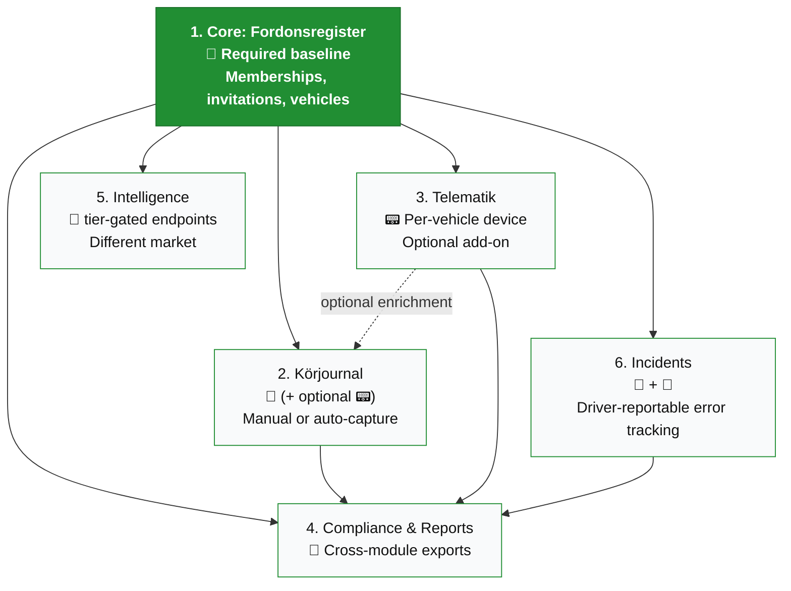

# Fordonskollen — Modules & Packaging

How the product is broken into features that ship independently, can be
sold separately, and degrade gracefully when a customer hasn't bought
all of them.

> **Core principle:** Each data source from `ARCHITECTURE.md` maps to
> one module. A customer's organisation subscribes to the **modules**
> they need, activates 📟 telematics **per-vehicle**, and grants
> drivers access **per-membership** — never per-account.

This doc is paired with `TARGET.md`, which defines the underlying
schema, role model, and access controls these modules build on.

---

## The six modules

| # | Module | Source | What it ships | Sellable on its own |
|---|---|---|---|---|
| 1 | **Core: Fordonsregister** | 📡 | Vehicle list, trafikljus, besiktning/skatt alerts, service schedule, build sheet, memberships & invitations | ✅ Required baseline |
| 2 | **Körjournal** | 📝 (+ optional 📟) | Manual trip entry, driver-scoped journal, attestation, audit log, 6-year retention | ✅ Works without devices |
| 3 | **Telematik** | 📟 | Live map, geofences, ECU readings, crash detection, auto-capture trips | ✅ Per-vehicle add-on |
| 4 | **Compliance & Reports** | 🧮 over all sources | Skatteverket export, GDPR export, cost reports | ✅ Add-on to Körjournal or Telematik |
| 5 | **Intelligence** | 📡 (tier-gated endpoints) | Valuation, owner lookup, ad-feed, statistics | ✅ Different market segment |
| 6 | **Incidents** | 📝 + 🧮 | Vehicle-tied error reports with photos and location, configurable visibility | ✅ Bundled with Core or sold standalone |

Module 6 (Incidents) was promoted from "unmapped working feature"
to a first-class module because it already exists in production
(formerly the `claude_error_reports` / `claude_incident_steps`
tables — see `SYSTEM.md`) and serves a real customer need on its
own.

---

## Module dependency graph



The dotted arrow from **Telematik** to **Körjournal** is the key
modularity move: körjournal **can consume** telematics data when it's
available (auto-capture mode), but works fully without it
(manual mode). This lets a customer buy körjournal first, add
devices later, and have everything work continuously.

**Incidents** is a new first-class module. It can ship on its own
(drivers reporting issues without a journal) or feed into compliance
exports for fleet damage reports.

---

## Module 1 — Core: Fordonsregister (📡)

The baseline every customer gets. Covers the registry-driven vehicle
data **plus the access-control machinery** that every other module
builds on. Works for **any vehicle in vägtrafikregistret** —
including trailers, motorredskap, and unequipped fleet vehicles.

**What ships — vehicle data:**
- Vehicle list with regnr, make, model, status (Itrafik / Avställd)
- `MV2a` Grundfakta panel (VIN, year, color, tekniska data)
- `SB1c` + `MV2b` Trafikljus derivation (besiktning, skatt, försäkring)
- `AL2` Snart förfaller alerts (registry-date driven)
- `RP3` OEM service schedule
- `RP4` Build sheet
- `RP2` Service history (read-only)
- `vehicle_snapshots` history (registry change detection)

**What ships — access control (per `TARGET.md`):**
- Multi-tenant organisations
- Memberships with roles (`owner`, `admin`, `driver`)
- Email invitations and onboarding flow
- Subscription billing (Stripe)
- Audit log (`activities`)
- Super-user support sessions for cross-tenant debugging

**Explicitly NOT in core:**
- Live position (needs Telematik)
- Trip recording (needs Körjournal)
- Incident reporting (needs Incidents)
- Skatteverket export (needs Compliance & Reports)
- Crash alerts (needs Telematik)

**Why this is the right baseline:** A customer with a fleet of trucks
+ trailers can use this immediately, without buying any hardware. A
small business with one company car gets useful besiktning reminders
on day one. It's also the only module that requires zero
device-side logistics — no shipping, no install.

The access-control machinery sits inside Core because every other
module needs it — there's no useful körjournal, telematik, or
incident flow without users, organisations, and roles.

---

## Module 2 — Körjournal (📝, optionally 📟)

The tax-grade driving log. Works in two modes:

| Mode | Requires | Driver experience |
|---|---|---|
| **Manual** | Just Core | Driver fills in date, from→to, ärende, km, privat/tjänst after each trip |
| **Auto-capture** | Core + Telematik for that vehicle | Trip pre-populated from ECU + GPS; driver only confirms ärende and classification |

**What ships:**
- `RP1a` Trip records, scoped to `driver_user_id` (the human who drove)
- `RP1b` Mätarställning tracking (manual entry, or ECU when device present)
- `RP1c` Monthly attestation with audit log — drivers attest their
  own journal; owners and admins can counter-sign
- `RP1d` Per-period export (PDF, CSV)
- 6-year retention with audit trail
- Driver-scoped views: drivers see only their own trips; owners and
  admins see all trips across the organisation

**Why this is its own module:**
- Carries Skatteverket compliance weight — separate legal scope
- 6-year retention has real storage cost
- Audit-log infrastructure isn't needed by other modules
- Many customers want körjournal on **private cars used in service**
  (milersättning) where there's no fleet device involved at all

**Per-vehicle behaviour:** Within an account that has Körjournal,
each vehicle can be set to manual or auto-capture mode independently.
A mixed fleet might run auto on the equipped vans and manual on
the boss's company car.

---

## Module 3 — Telematik (📟)

The FMC003 device integration. Activated **per-vehicle** — a customer
with 20 vehicles might equip 5.

**What ships:**
- `MV1` Live map with vehicle pins
- `MV1c` Geofence events (entry/exit)
- `MV2c` Live ECU readings (odometer, fuel, DTCs)
- `AL1` Critical-now alerts (crash, severe DTC, geofence breach)
- Driver behaviour scoring (harsh braking, acceleration, idling)
- Auto-capture feed for Körjournal (when both modules present)

**Per-vehicle gating** — the most important architectural rule in
this module:

```
vehicle.has_device === true   → show live tab, map pin, alerts
vehicle.has_device === false  → hide all live UI, show only registry data
vehicle.is_trailer === true   → never offer device pairing at all
```

A trailer (släp, kategori O) appears in the fleet list with its
besiktning and tekniska data, but the UI must not even hint at
device pairing. Same for motorredskap and other non-OBD categories.

**Why per-vehicle, not per-account:** A logistics company might have
trucks (equipped), trailers (uneqipable), and a few pool cars
(intentionally unequipped to keep cost down). Forcing all-or-nothing
on the whole account would block the sale.

---

## Module 4 — Compliance & Reports (🧮)

The export and reporting layer. Aggregates whatever modules the
customer has subscribed to, formatted for legal and operational use.

**What ships:**
- `RP1d` Skatteverket-formatted körjournal export (PDF + CSV)
- `RP6` GDPR data subject access export
- `RP5` Driftkostnader / cost reports
- Bulk multi-vehicle reports for fleet managers
- Custom date ranges, attestation receipts

**Why separate:** Reports are inherently complex (Law 9: Failure —
isolated complexity). They evolve with regulatory changes. They have
heavier compute / PDF generation needs. And they're often the
*upsell* moment — a customer using free körjournal hits "Export to
Skatteverket" and is prompted to upgrade.

**Cross-module behaviour:** Reports adapt to what the account has.
A customer with Core + Compliance gets registry-only reports. Adding
Körjournal extends the export with trip records. Adding Telematik
adds drive behaviour data. Each module independently widens what
Compliance can produce.

---

## Module 5 — Intelligence (📡 tier-gated)

The 403 endpoints from Biluppgifter — different market segment.

**What ships:**
- `valuation/regno/{regno}` — current market value
- `owner/*` lookups by phone, ID, or regnr
- `ad/feed`, `ad/regno/{regno}` — used-car ad listings
- `statistics/*` — fleet ownership statistics
- `vehiclehistory/*` — full registry change history

**Why separate market:** The buyer is a car dealer, leasing company,
or fleet acquisition team — not the operational fleet manager.
Different sales motion, different price point, different SLAs.

**Why ship last:** Lowest synergy with the other modules; high
dependence on Biluppgifter's commercial tier; small fraction of the
core SaaS audience would buy it.

---

## Module 6 — Incidents (📝 + 🧮)

Driver-reportable error tracking on organisation vehicles. Already
exists in production (formerly the `claude_error_reports` /
`claude_incident_steps` tables — see `SYSTEM.md`); promoted to a
first-class module because it serves a real customer need that
doesn't fit cleanly into any of the others.

**What ships:**
- Per-vehicle incident reports (`error_type`, `priority`, `status`)
- Photos and location capture from a phone (`photo_keys`, `lat`,
  `lng`, `location_name`)
- Per-org configurable visibility:
  - `own_only` — drivers see only their own reports (default)
  - `all_in_org` — drivers see colleagues' reports too
- Reusable workflow templates (`incident_steps`) — per-org or
  global defaults
- Status updates on own incidents by drivers; status updates on any
  by owners/admins
- Feed into Compliance for damage history exports

**Driver experience:** A driver pulls up to a vehicle, sees a tyre
issue, opens the app, taps "Report problem," picks the vehicle from
the list scoped to their org, fills in type/priority/description,
attaches photos, and submits. Location is captured automatically.

**Why this earns its own module:**
- Works without Körjournal — many customers want incident tracking
  but not a full tax journal
- Works without Telematik — phone-side, not device-side
- The visibility model is genuinely org-specific — a small family
  business wants full transparency; a logistics SMB wants privacy
- Can be sold standalone as a "fleet maintenance lite" product

**Cross-module behaviour:** When Compliance is also subscribed,
incident history flows into vehicle damage reports and insurance
exports. When Telematik is subscribed, crash detection events
auto-create draft incidents that the driver confirms — analogous to
the auto-capture pattern in Körjournal.

---

## The three-level gating model

Every feature in the codebase must pass three checks before
rendering. The third check (role) is new in `TARGET.md` — it didn't
exist when this doc was first written.

```
1. Subscription level: does this organisation's plan include the module?
2. Role level:         does the current user's membership permit this action?
3. Vehicle level:      does this specific vehicle support the feature?
```

| Module | Subscription check | Role check | Vehicle check |
|---|---|---|---|
| Core | Always true (baseline) | All members read; only owner/admin write | Always true (registry covers all) |
| Körjournal | `org.subscription.has(:korjournal)` | All roles create own trips; only owner/admin see all org trips | `vehicle.korjournal_mode in [manual, auto]` |
| Telematik | `org.subscription.has(:telematik)` | All roles read live data; only owner/admin configure devices | `vehicle.has_device == true` and not a trailer |
| Compliance | `org.subscription.has(:compliance)` | Owner/admin only — exports include cross-driver data | Per-feature |
| Intelligence | `org.subscription.has(:intelligence)` | Owner/admin only | Always true (registry-wide) |
| Incidents | `org.subscription.has(:incidents)` | All roles create; visibility per `org.settings.incident_visibility` | Always true (any org vehicle) |

This is what makes mixed fleets *and* mixed teams work:

- A **trailer** in a Telematik-enabled org passes subscription + role
  but fails the vehicle check, so the live UI is gracefully hidden.
- A **driver** in a Compliance-enabled org passes subscription +
  vehicle but fails the role check, so the export buttons are
  hidden — they can still see their own data, just not the
  org-wide reports.
- A **super user** with an active support session bypasses the role
  check (per `TARGET.md`) but still respects the subscription check
  — they can't see Telematik data for an org that doesn't subscribe,
  because that data doesn't exist.

---

## Codebase structure (Elixir / Phoenix)

The natural fit for an optional-module product is a **Phoenix
umbrella project**. Each module is its own OTP application with
its own supervision tree, `mix.exs`, and dependency boundary. The
web app composes whatever modules are running.

This maps better to the module model than a single Phoenix app with
contexts because:

- Each app declares its own deps in `mix.exs` — sibling violations
  fail at compile time, not in code review
- Modules can be started, stopped, or omitted at runtime via the
  application controller
- Cross-module messaging via `Phoenix.PubSub` means "module not
  installed" silently becomes "no events arrive" — no conditional
  bridge code needed

```
fordonskollen_umbrella/
├── apps/
│   ├── fordonskollen_core/                # Module 1 — required baseline
│   │   ├── lib/
│   │   │   └── fordonskollen_core/
│   │   │       ├── application.ex
│   │   │       ├── accounts/                      # users, BankID, sessions
│   │   │       │   ├── user.ex                    # Ecto schema
│   │   │       │   └── auth.ex
│   │   │       ├── organizations/                 # orgs, memberships, invites
│   │   │       │   ├── organization.ex
│   │   │       │   ├── membership.ex
│   │   │       │   └── invitation.ex
│   │   │       ├── billing/                       # subscriptions, Stripe
│   │   │       │   ├── subscription.ex
│   │   │       │   └── stripe_webhook.ex
│   │   │       ├── registry/                      # 📡 Biluppgifter
│   │   │       │   ├── biluppgifter_client.ex
│   │   │       │   ├── vehicle.ex
│   │   │       │   ├── snapshot.ex                # vehicle_snapshots
│   │   │       │   └── cache.ex                   # ETS-backed
│   │   │       ├── trafikljus.ex                  # 🧮 pure function
│   │   │       ├── audit.ex                       # activities log
│   │   │       ├── authorization.ex               # role/policy logic
│   │   │       └── feature_flags.ex               # 3-level gating
│   │   └── mix.exs
│   │
│   ├── fordonskollen_korjournal/          # Module 2
│   │   ├── lib/
│   │   │   └── fordonskollen_korjournal/
│   │   │       ├── application.ex
│   │   │       ├── manual.ex              # public API for manual entry
│   │   │       ├── auto_capture.ex        # GenServer subscribed to PubSub
│   │   │       ├── attestation.ex
│   │   │       ├── retention.ex           # 6-year archive policy
│   │   │       ├── trip.ex                # Ecto schema
│   │   │       └── monthly_attestation.ex # Ecto schema
│   │   └── mix.exs                        # deps: [:fordonskollen_core] only
│   │
│   ├── fordonskollen_telematik/           # Module 3
│   │   ├── lib/
│   │   │   └── fordonskollen_telematik/
│   │   │       ├── application.ex
│   │   │       ├── ingest/
│   │   │       │   ├── codec8_receiver.ex # GenServer, TCP listener
│   │   │       │   └── parser.ex          # FMC003 wire protocol
│   │   │       ├── live_tracking.ex
│   │   │       ├── events/
│   │   │       │   ├── geofence.ex
│   │   │       │   ├── crash_detection.ex
│   │   │       │   └── publisher.ex       # broadcasts via PubSub
│   │   │       └── ecu/
│   │   │           ├── odometer.ex
│   │   │           ├── fuel.ex
│   │   │           └── dtc.ex             # DTC decoder
│   │   └── mix.exs                        # deps: [:fordonskollen_core]
│   │
│   ├── fordonskollen_compliance/          # Module 4
│   │   ├── lib/
│   │   │   └── fordonskollen_compliance/
│   │   │       ├── application.ex
│   │   │       ├── skv_export.ex          # Skatteverket format
│   │   │       ├── gdpr_export.ex
│   │   │       ├── cost_reports.ex
│   │   │       └── pdf.ex                 # ChromicPDF wrapper
│   │   └── mix.exs
│   │
│   ├── fordonskollen_intelligence/        # Module 5
│   │   └── ...
│   │
│   ├── fordonskollen_incidents/           # Module 6
│   │   ├── lib/
│   │   │   └── fordonskollen_incidents/
│   │   │       ├── application.ex
│   │   │       ├── incident.ex            # Ecto schema
│   │   │       ├── step.ex                # incident_steps schema
│   │   │       ├── visibility.ex          # per-org visibility logic
│   │   │       └── photo_storage.ex       # S3/Tigris keys
│   │   └── mix.exs                        # deps: [:fordonskollen_core]
│   │
│   ├── fordonskollen_support/             # Cross-cutting: super-user sessions
│   │   ├── lib/
│   │   │   └── fordonskollen_support/
│   │   │       ├── application.ex
│   │   │       ├── session.ex             # super_user_sessions schema
│   │   │       ├── lifecycle.ex           # open / close / auto-expire
│   │   │       └── access_log.ex          # what got viewed during session
│   │   └── mix.exs                        # deps: [:fordonskollen_core]
│   │
│   └── fordonskollen_web/                 # Phoenix LiveView
│       ├── lib/
│       │   └── fordonskollen_web/
│       │       ├── endpoint.ex
│       │       ├── router.ex
│       │       ├── live/
│       │       │   ├── dashboard_live.ex
│       │       │   ├── vehicle_live.ex
│       │       │   ├── korjournal_live.ex
│       │       │   ├── incident_live.ex
│       │       │   └── support_session_live.ex   # super-user UI
│       │       └── components/
│       │           ├── vehicle_card.ex
│       │           ├── alert_badge.ex
│       │           ├── trafikljus_badge.ex
│       │           └── support_banner.ex         # shown during sessions
│       └── mix.exs                        # deps: all modules
│
├── config/
│   ├── config.exs
│   └── runtime.exs                        # feature flag config per env
└── mix.exs                                # umbrella root + releases
```

### Two architectural rules — Elixir version

**1. No sibling deps in `mix.exs`.**
A module's `mix.exs` may declare `:fordonskollen_core` as a
dependency, never a sibling like `:fordonskollen_telematik`. The
umbrella's dependency graph enforces this at compile time — `mix
compile` fails if a sibling import sneaks in.

**2. Cross-module communication is `Phoenix.PubSub`, not direct
calls.** The bridge from Telematik to Körjournal isn't a function
call. Telematik publishes:

```elixir
# fordonskollen_telematik/lib/.../events/publisher.ex
Phoenix.PubSub.broadcast(
  Fordonskollen.PubSub,
  "telematik:trip_ended",
  {:trip_ended, %TripEvent{vehicle_id: id, ecu_km: km, ...}}
)
```

Körjournal's auto-capture subscribes:

```elixir
# fordonskollen_korjournal/lib/.../auto_capture.ex
def init(_opts) do
  Phoenix.PubSub.subscribe(Fordonskollen.PubSub, "telematik:trip_ended")
  {:ok, %{}}
end

def handle_info({:trip_ended, event}, state) do
  # pre-populate trip record, await driver confirmation
  Korjournal.Manual.create_pending_trip(event)
  {:noreply, state}
end
```

If the Telematik app isn't running (customer didn't buy that
module), no events are broadcast and Körjournal silently runs in
manual-only mode. **No conditional checks, no feature-detection
code** — absence of the publishing app simply means absence of
messages.

### Feature flags

The three gating levels live in two collaborating modules:
`feature_flags.ex` for subscription + vehicle, `authorization.ex`
for role.

```elixir
defmodule Fordonskollen.FeatureFlags do
  # Subscription-level: does the org have this module?
  def subscribed?(org, :korjournal),  do: org.subscription.korjournal?
  def subscribed?(org, :telematik),   do: org.subscription.telematik?
  def subscribed?(org, :incidents),   do: org.subscription.incidents?
  def subscribed?(org, :compliance),  do: org.subscription.compliance?

  # Vehicle-level: does this vehicle support the feature?
  def vehicle_supports?(vehicle, :telematik) do
    vehicle.has_device? and not trailer?(vehicle)
  end

  def vehicle_supports?(_vehicle, _feature), do: true

  defp trailer?(%{category: c}) when c in ["O1", "O2", "O3", "O4"], do: true
  defp trailer?(_), do: false
end

defmodule Fordonskollen.Authorization do
  # Role-level: does this user's membership permit this action?
  def can?(%{role: "owner"}, _action),               do: true
  def can?(%{role: "admin"}, action) when action in [
        :manage_billing, :transfer_ownership
      ], do: false
  def can?(%{role: "admin"}, _action), do: true

  def can?(%{role: "driver"}, action) when action in [
        :create_trip, :attest_own_journal,
        :create_incident, :see_own_incidents
      ], do: true
  def can?(%{role: "driver"}, _action), do: false

  # Super-user override (only inside an active support session)
  def can?(%{is_super_user: true}, _action), do: support_session_active?()
  defp support_session_active?(), do: # ... checks process dictionary or context
end
```

LiveView surfaces consult all three before rendering:

```elixir
~H"""
<%= if FeatureFlags.subscribed?(@org, :telematik) and
       FeatureFlags.vehicle_supports?(@vehicle, :telematik) and
       Authorization.can?(@membership, :read_live_data) do %>
  <.live_component module={LiveMap} vehicle={@vehicle} id="map" />
<% end %>
"""
```

A useful pattern: wrap the three checks in a single helper
`feature_visible?/3` that takes `(membership, vehicle, feature)` and
returns the AND of the three checks. Saves repetition in
templates.

### Mix releases and tier strategy

Don't ship different binaries per customer tier. One release runs
all apps in production; runtime feature flags handle per-account
access. This is simpler operationally and means an upgrade path
is just a database update, not a redeploy.

```elixir
# umbrella mix.exs
releases: [
  fordonskollen: [
    applications: [
      fordonskollen_core: :permanent,
      fordonskollen_korjournal: :permanent,
      fordonskollen_telematik: :permanent,
      fordonskollen_compliance: :permanent,
      fordonskollen_intelligence: :permanent,
      fordonskollen_incidents: :permanent,
      fordonskollen_support: :permanent,
      fordonskollen_web: :permanent
    ]
  ]
]
```

During development you can start subsets to work without all
modules running:

```bash
# work on core without telematik dependencies booting
iex --cookie dev -S mix run --no-start \
  -e "Application.ensure_all_started(:fordonskollen_core)"
```

### One Repo or several?

For a multi-tenant SaaS, **one shared `Fordonskollen.Repo`** in
`fordonskollen_core` is simpler than per-app repos. Each module
defines its own Ecto schemas pointing at its own tables, but they
share connection pooling and transactions. This also lets
Compliance reach across module tables for export queries without
a distributed transaction.

The boundary that matters is **schema ownership**: only
`fordonskollen_korjournal` writes to `trips` and
`monthly_attestations`, only `fordonskollen_telematik` writes to
device tables, only `fordonskollen_incidents` writes to `incidents`
and `incident_steps`, only `fordonskollen_support` writes to
`super_user_sessions`. Modules can *read* each other's tables via
the public context API but never write directly. The full
schema-to-module mapping lives in `TARGET.md`.

---

## Suggested packaging tiers

A starting point for the price page. Customers can mix and match;
these are common bundles. All tiers include unlimited members
within the org — no per-seat charges except for Telematik (which
is per equipped vehicle).

| Tier | Modules included | Target customer |
|---|---|---|
| **Bas** (free or low) | 1 Core | Single vehicle owner, trial users |
| **Standard** | 1 Core + 2 Körjournal (manual) + 4 Compliance + 6 Incidents | Sole traders, small companies with company cars |
| **Telematik** add-on | + 3 Telematik (priced per equipped vehicle) | Anyone with FMC003 devices |
| **Pro** | All operational modules (1, 2, 3, 4, 6) | Fleet managers, logistics SMBs |
| **Enterprise** | All modules + API access + multi-org management | Large fleets, leasing companies, contractors |
| **Marketplace** | 1 Core + 5 Intelligence | Dealers, valuators (different sales motion) |

A few pricing rules worth holding:

- **Telematik is per equipped vehicle**, not a flat module fee.
  Customers pay for devices they actually run, matching the
  per-vehicle gating model in the codebase.
- **Drivers don't count as billable seats.** A subscription is
  priced for the organisation's vehicles and modules — inviting
  more drivers (or revoking them) doesn't change the price.
- **Multi-org members count once.** A contractor driving for
  three customer orgs has one user record and three memberships;
  each org pays for its own subscription independently.

---

## Suggested shipping order

What to build first so each release is independently sellable.
Reflects the migration sequence in `TARGET.md` — phases 1–2 are
mostly schema work on existing functionality, phases 3+ add new
features.

| Phase | Ships | Why this order |
|---|---|---|
| **1** | Core access machinery (memberships, invitations, drop credits, drop `claude_` prefix) | Unblocks everything else; large effort but mostly schema + auth refactor; per `TARGET.md` migration steps 1–7 |
| **2** | Incidents (Module 6 — re-launched on new schema) | Already built; just renamed and rewired through new role model; ships fast as a visible win |
| **3** | Subscription billing + Stripe integration | Replaces credits; required before any paid plans launch |
| **4** | Manual Körjournal (Module 2 without auto-capture) | Immediately useful; works with just Core; opens revenue from sole-trader market |
| **5** | Compliance basics (Module 4: SKV export) | Completes the manual körjournal value prop; unlocks Pro tier |
| **6** | Super-user support sessions (Module Support) | Operational necessity once paying customers exist and tickets arrive |
| **7** | Telematik (Module 3) | Larger engineering scope; ships when device logistics + ingest pipeline are ready |
| **8** | Auto-capture Körjournal (the bridge) | Connects 4 ↔ 7; small effort once both exist |
| **9** | Compliance advanced (cost reports, GDPR exports) | Iterative once core export pipeline exists |
| **10** | Intelligence (Module 5) | Different market; build when the operational product is stable |

Each phase is independently demoable and chargeable — there's no
phase that requires the next one to deliver value to a customer.

The order is more aggressive on **infrastructure first** (phases
1–3) than the original five-module plan because the schema migration
is foundational. Doing it in two clean phases now is cheaper than
retrofitting role-based access later.

---

## How this changes the architecture doc

The tree in `ARCHITECTURE.md` doesn't change — it remains the
information architecture. But every node in it now belongs to a
module:

- All `TB*`, `SB*`, `MV2a`, `MV2b`, `MV2e` → **Core**
- `MV1*`, `MV2c`, `MV2d`, `AL1` → **Telematik**
- `RP1*` → **Körjournal**
- `RP1d`, `RP5`, `RP6` → **Compliance & Reports**
- *(Incidents is currently a separate surface, not yet in the
  ARCHITECTURE tree — adding it as `INC` under the dashboard root,
  next to Reports, would close that gap)*
- *(Intelligence is a separate surface, not in the current tree)*

A tag could be added to each node label in the diagram (e.g.
`[Core]`, `[Telematik]`, `[Incidents]`) so the tree doubles as a
feature-availability map. This becomes useful when the codebase
implements the three-level gating: each LiveView component looks
up its tag → module mapping → checks subscription, role, vehicle.
